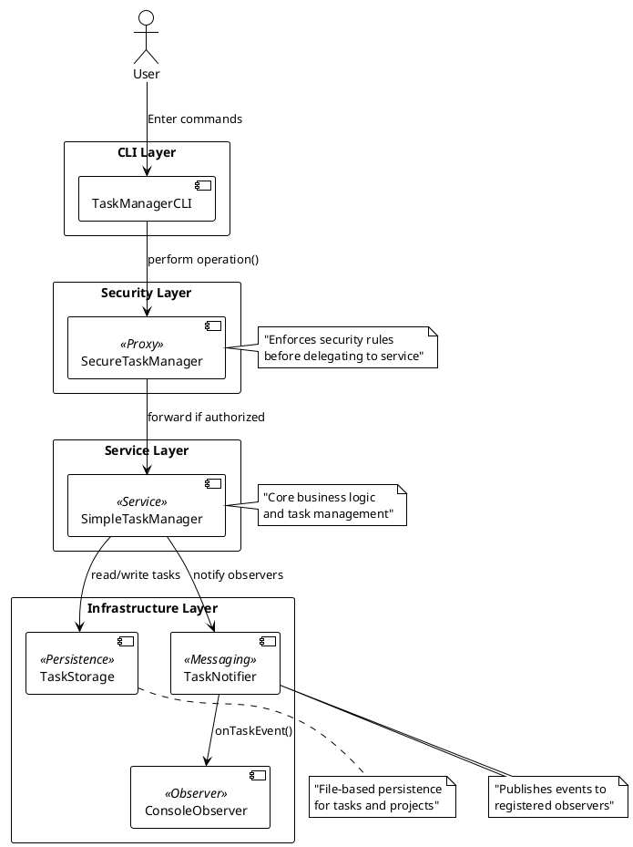

# Task Manager

## 1. Application Overview and Functionality

The Task Manager is a console-based Java application that allows users to create, list, update, delete, and sort tasks and projects. Each task can have a title, description, status (TODO, IN_PROGRESS, DONE, CANCELLED), and priority level. Projects can contain multiple tasks (and nested sub-projects), illustrating a hierarchical structure. All operations are performed via a Command-Line Interface (CLI), with real-time notifications and basic security checks.

**Key features:**
- **Task & Project Management:** Create standalone tasks or grouped projects, update their attributes, and delete them.  
- **Sorting & Iteration:** View tasks sorted by title, priority, or status using interchangeable strategies, and traverse them with a custom iterator.  
- **Design Patterns Demonstration:** Showcases multiple classic design patterns in action.  
- **Persistence & Notifications:** Simple file-based storage persists data between runs, while observers receive notifications on CRUD events.  

## 2. Technologies and Patterns Used

- **Java (JDK 11+):** Core programming language for portability and strong typing.  
- **Plain-Text File Storage:** Simplified persistence layer using thread-safe collections and plain text files (no external DB).  
- **Command-Line Interface:** Lightweight, no additional UI frameworks.  

### Design Patterns

| Pattern        | Components                             | Justification                                                                                   |
| -------------- | -------------------------------------- | ----------------------------------------------------------------------------------------------- |
| Singleton      | `AppConfig`                            | Ensures a single configuration instance manages application settings.                           |
| Factory Method | `TaskFactory`                          | Centralizes creation of `Task` and `Project` objects, simplifying object instantiation.         |
| Builder        | `TaskBuilder`                          | Constructs `Task` objects step-by-step with optional parameters, improving readability.         |
| Adapter        | `LegacyTaskAdapter`                    | Transforms modern `Task` objects to legacy format for compatibility with old systems.           |
| Composite      | `TaskComponent`, `Task`, `Project`     | Treats individual tasks and project groups uniformly via a common interface.                    |
| Iterator       | `TaskIterator`                         | Provides a standard way to traverse collections of tasks without exposing underlying structure. |
| Strategy       | `SortStrategy`, `SortByTitle`, etc.    | Enables dynamic swapping of sorting algorithms at runtime.                                      |
| Observer       | `TaskNotifier`, `ConsoleObserver`      | Decouples event generation from handling, notifying observers on task events.                   |
| Decorator      | `TaskDecorator`, `UrgentTaskDecorator` | Dynamically adds additional behavior (e.g., urgency messages) to existing `Task` objects.       |
| Proxy          | `SecureTaskManager`                    | Controls access to `TaskManager` operations, enforcing simple security rules.                   |

## 3. Setup and Execution Instructions

1. **Prerequisites**
   - Java Development Kit (JDK) 11 or higher installed.  
   - A terminal/console application.  

2. **Compile the Application**
   ```bash
   # Navigate to the project root (where the src directory resides)
   cd taskmanager/taskmanager

   # Create a directory for compiled classes
   mkdir -p bin

   # Compile all Java source files
   javac -d bin src/main/java/com/taskmanager/**/*.java
   ```

3. **Run the Application**
   ```bash
   # From the project root
   java -cp bin com.taskmanager.Main
   ```

4. **Using the CLI**
   - Type help to view available commands.
   - Follow prompts to create tasks/projects, list them, update attributes, sort, and delete.
   - Type exit or quit to terminate the application.

## 4. UML Diagrams

### 4.1 Class Diagram

```plantuml
@startuml
package com.taskmanager {
  interface TaskComponent {
    + getId(): String
    + getTitle(): String
    + setTitle(title: String): void
    + display(indent: int): void
    + isLeaf(): boolean
    + getStatus(): TaskStatus
    + setStatus(status: TaskStatus): void
    + getPriority(): TaskPriority
    + setPriority(priority: TaskPriority): void
  }

  class Task {
    - id: String
    - title: String
    - description: String
    - status: TaskStatus
    - priority: TaskPriority
    + getId(): String
    + getTitle(): String
    + setTitle(title: String): void
    + getDescription(): String
    + setDescription(description: String): void
    + getStatus(): TaskStatus
    + setStatus(status: TaskStatus): void
    + getPriority(): TaskPriority
    + setPriority(priority: TaskPriority): void
    + display(indent: int): void
    + isLeaf(): boolean
  }

  class Project {
    - id: String
    - title: String
    - description: String
    - components: List<TaskComponent>
    + getId(): String
    + getTitle(): String
    + setTitle(title: String): void
    + getDescription(): String
    + setDescription(description: String): void
    + add(component: TaskComponent): void
    + remove(component: TaskComponent): void
    + getComponents(): List<TaskComponent>
    + display(indent: int): void
    + isLeaf(): boolean
  }

  TaskComponent <|.. Task
  TaskComponent <|.. Project
  Project o-- TaskComponent

  class TaskBuilder {
    - id: String
    - title: String
    - description: String
    - status: TaskStatus
    - priority: TaskPriority
    + setId(id: String): TaskBuilder
    + setTitle(title: String): TaskBuilder
    + setDescription(description: String): TaskBuilder
    + setStatus(status: TaskStatus): TaskBuilder
    + setPriority(priority: TaskPriority): TaskBuilder
    + build(): Task
  }

  class TaskFactory {
    + createTask(title: String): Task
    + createProject(title: String): Project
    + createTaskComponent(type: String, title: String): TaskComponent
  }

  class LegacyTaskAdapter {
    - modernTask: Task
    + LegacyTaskAdapter(task: Task)
    + getLegacyFormat(): String
    + convertToModernTask(legacyData: String): Task
  }

  class TaskIterator {
    - tasks: List<Task>
    - currentIndex: int
    + hasNext(): boolean
    + next(): Task
    + reset(): void
  }

  interface SortStrategy {
    + sort(tasks: List<Task>): List<Task>
  }

  class SortByTitle {
    + sort(tasks: List<Task>): List<Task>
  }

  class SortByPriority {
    + sort(tasks: List<Task>): List<Task>
  }

  class SortByStatus {
    + sort(tasks: List<Task>): List<Task>
  }

  class TaskNotifier {
    - observers: List<TaskObserver>
    + addObserver(observer: TaskObserver): void
    + removeObserver(observer: TaskObserver): void
    + notifyObservers(task: Task, action: String): void
  }

  interface TaskObserver {
    + onTaskCreated(task: Task): void
    + onTaskUpdated(task: Task): void
    + onTaskDeleted(task: Task): void
  }

  class ConsoleObserver {
    + onTaskCreated(task: Task): void
    + onTaskUpdated(task: Task): void
    + onTaskDeleted(task: Task): void
  }

  interface TaskManager {
    + createTask(title: String, description: String): Task
    + createProject(title: String, description: String): Project
    + updateTask(id: String, title: String, description: String): void
    + deleteTask(id: String): void
    + getAllTasks(): List<Task>
    + sortTasks(strategy: SortStrategy): List<Task>
  }

  class SecureTaskManager {
    - taskManager: TaskManager
    - isAuthorized: boolean
    + SecureTaskManager(taskManager: TaskManager)
    + createTask(title: String, description: String): Task
    + createProject(title: String, description: String): Project
    + updateTask(id: String, title: String, description: String): void
    + deleteTask(id: String): void
    + getAllTasks(): List<Task>
    + checkAuthorization(): boolean
  }

  class SimpleTaskManager {
    - storage: TaskStorage
    - notifier: TaskNotifier
    + createTask(title: String, description: String): Task
    + createProject(title: String, description: String): Project
    + updateTask(id: String, title: String, description: String): void
    + deleteTask(id: String): void
    + getAllTasks(): List<Task>
    + sortTasks(strategy: SortStrategy): List<Task>
  }

  class TaskStorage {
    - tasks: Map<String, Task>
    + save(task: Task): void
    + load(id: String): Task
    + loadAll(): List<Task>
    + delete(id: String): void
  }

  class AppConfig {
    - instance: AppConfig
    - properties: Properties
    - AppConfig()
    + getInstance(): AppConfig
    + getProperty(key: String): String
    + setProperty(key: String, value: String): void
  }

  ' Relationships
  TaskBuilder --> Task : creates
  TaskFactory --> TaskComponent : creates
  LegacyTaskAdapter --> Task : adapts
  TaskIterator --> Task : iterates
  SortByTitle ..|> SortStrategy
  SortByPriority ..|> SortStrategy
  SortByStatus ..|> SortStrategy
  TaskNotifier --> TaskObserver : notifies
  ConsoleObserver ..|> TaskObserver
  SecureTaskManager ..|> TaskManager
  SimpleTaskManager ..|> TaskManager
  SimpleTaskManager --> TaskStorage : uses
  SimpleTaskManager --> TaskNotifier : uses
  SecureTaskManager --> TaskManager : delegates to
}
@enduml
```

![Class Diagram](https://www.plantuml.com/plantuml/png/xLVXRjis4Fxlf-2_oLZi1n02esc30W6IhbYo1s34YyD59WNoPDHR--uJ5Pvq36N1Mpgi0_8dCUy-VZhoxZwTtdcK3jjTlMXazIIt82gxMwFqJpjfkgKJVow4q0R1FSWAn5td-M1tZJLWiFS9yRFO0bwfObcAMtJQR4VhdSOQCeSd1uQ_vEnGUwjLn2ZjcreU2cqK62n322b0-skG3u7xtjeQf1cVUeiIMnzS8TpdrV1eylh-7uSC_CJpsMdhD1w8YTR4nH1D_942HyPlY-vFLKllUq2ykPNGYeuV3VnAoAR0LqutgArvuSaF4HtJyVmhwQBDbsEKEKNgpWz4T3zm4bzHbopxdvtz7IhyNWLGKI_wKbnhZ-T9Wsx-DmcNIXN3MSfKPbAaWvtTmpoOHpbuGYrDtz4h4vjguldNzRetJNee_vsJAi6kLYambOhthQuLkFzMCNnVG5gnvB7OviicXywNnzos-SPFDvpStVcs-x0YmSZL-wEiqBh3yFgh74Y4u9ayUeAAMS-0qPvWaweeyD0C6yv4zY2EJKE-Xgsi3W5meMI3h9PsLe4pmSCZpJSKE42MOsSzmpvQjvEO2K1bpHuStjcRuHb5tM-ub2W9VFIAhn2SH3k66YBW6hSX0MoT0uDNHi6NqBHqWu_IVu8lcCy79bhPUHrum29zMREPvzOwxCAL2Dinvxup5bbGIxv8JnLOtX_w1daj2TNkQtcU6-UVimJJ9ulwGREQilSUt1uS9_absZQZsfEf87mfE79Ay__M5XFYEf3Fime-4x9AbMOwxmdvS4dMz9tMzwTYhCJ2KRyrwWJK9TGmYKel-uCrtjRm8mIKNj4D-r2OKyEpvArqkaJExqvrisqKFLkhSUj9J7p8WneoccookAZh04ddYWrhfcUlZz9H9a8orvnGjGxurJ8H95l9xpwwjRzeyT4w_GUe5xANanR7o9Oi6Mzvh1wXUg9hbU5HHqVxMxrhwicyURIkCz2uqY-YoqJzB1CrVKl1zsabTjyl9uaRsPpJAPAdoJqS5SZQoeanc3cxWwHdIAuXtPfh_4NJT3B_eBVZj6yyIbD1EVg6UTqsu5233vcZtz4vW0ishrr5hcAPi94xaXoA9pXGbFbdtIJiJEnbtSAHi_qaVeMwRnt_g9iG8l-kMQqs_LgKiMO9G5Cs0ORfbYFpMPKJoc0YFXefEK1tjaZ4vxFr-kicAJ7o3wFNSGXDLHC0rk8K9nynIXA3BfpiTH_e4lX2P9fEAFvYI5NfT115HzrJYjQ3duNIoGYR1fXYQLtsdR4DEH1e5zyMxy2eTbV_1G00)

<details>
<summary>View PlantUML Source Code</summary>



</details>

### 4.2 Architectural Diagram


<details>
<summary>View PlantUML Source Code</summary>



</details>

## 5. Known Limitations and Future Work

- **Persistence:** Currently uses simple text files; consider integrating an embedded (H2) or external relational database for robustness.
- **Concurrency:** Limited thread safety via basic collections; advanced locking or transaction management could be added for multi-user scenarios.
- **User Interface:** CLI-only; develop a GUI or web-based frontend (e.g., using Spring Boot + React) for better usability.
- **Error Handling:** Minimal validation and error messages; introduce more comprehensive input validation and exception management.
- **Extensibility:** Add RESTful APIs for integration with other systems, and support for task dependencies and scheduling features.
- **Test Coverage:** Increase unit and integration tests for all components; adopt a continuous integration pipeline.